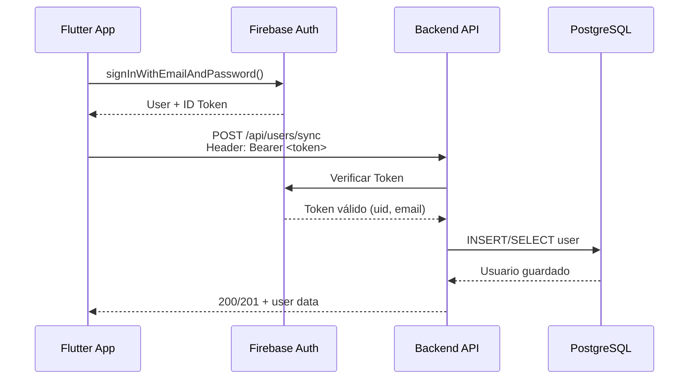

# 📡 Documentación de Endpoints - PESkaos Backend

## 🔧 Configuración Base

**URL Base del Servidor:**

```
http://localhost:3001
```

**Para desarrollo móvil:**

- Android Emulator: `http://10.0.2.2:3001`
- iOS Simulator: `http://localhost:3001`
- Dispositivo físico: `http://[IP_DE_TU_MAQUINA]:3001` (ej: `http://192.168.1.100:3001`)

---

## 🔐 Autenticación

Todos los endpoints protegidos requieren un **Bearer Token** de Firebase en el header:

```dart
headers: {
  'Authorization': 'Bearer $idToken',
  'Content-Type': 'application/json',
}
```

### Obtener el token en Dart/Flutter:

```dart
final idToken = await FirebaseAuth.instance.currentUser?.getIdToken();
```

---

## 📋 Endpoints Disponibles

### 1. Health Check

#### `GET /`

Verifica que el servidor está corriendo.

**Autenticación:** ❌ No requerida

**Ejemplo en Dart:**

```dart
final response = await http.get(
  Uri.parse('http://localhost:3001/'),
);

if (response.statusCode == 200) {
  print('API funcionando: ${response.body}'); // "API running."
}
```

---

### 2. Sincronizar Usuario

#### `POST /api/users/sync`

Sincroniza el usuario autenticado de Firebase a la base de datos PostgreSQL.

**Autenticación:** ✅ Requerida (Bearer Token)

**Headers:**

```
Authorization: Bearer <idToken>
Content-Type: application/json
```

**Request Body:** Ninguno (la información del usuario se extrae del token)

**Respuestas:**

| Código                      | Descripción             | Respuesta                                                                                       |
| --------------------------- | ----------------------- | ----------------------------------------------------------------------------------------------- |
| `200 OK`                    | Usuario ya existía      | `{ "message": "Usuario ya existía", "user": { "uid": "...", "email": "..." } }`                 |
| `201 Created`               | Usuario creado          | `{ "message": "Usuario sincronizado correctamente", "user": { "uid": "...", "email": "..." } }` |
| `401 Unauthorized`          | Token inválido/expirado | `{ "error": "No autorizado" }`                                                                  |
| `403 Forbidden`             | Token no proporcionado  | `{ "error": "Token no proporcionado" }`                                                         |
| `500 Internal Server Error` | Error del servidor      | `{ "error": "Error al sincronizar usuario" }`                                                   |

**Ejemplo en Dart:**

```dart
import 'package:http/http.dart' as http;
import 'package:firebase_auth/firebase_auth.dart';
import 'dart:convert';

Future<Map<String, dynamic>?> syncUser() async {
  try {
    final user = FirebaseAuth.instance.currentUser;
    if (user == null) return null;

    final idToken = await user.getIdToken();

    final response = await http.post(
      Uri.parse('http://localhost:3001/api/users/sync'),
      headers: {
        'Authorization': 'Bearer $idToken',
        'Content-Type': 'application/json',
      },
    );

    if (response.statusCode == 200 || response.statusCode == 201) {
      return jsonDecode(response.body);
    } else {
      print('Error ${response.statusCode}: ${response.body}');
      return null;
    }
  } catch (e) {
    print('Excepción: $e');
    return null;
  }
}
```

**Cuándo usarlo:**

- Después del registro del usuario
- Después del login del usuario
- Al iniciar la aplicación (para asegurar que el usuario existe en la BD)

---

## 🛠️ Próximos Endpoints (En desarrollo)

### Reciclaje

- `GET /api/recycling-points` - Listar puntos de reciclaje
- `GET /api/recycling-points/:id` - Obtener detalles de un punto
- `POST /api/recycling-points` - Crear punto de reciclaje (Admin)
- `PUT /api/recycling-points/:id` - Actualizar punto (Admin)
- `DELETE /api/recycling-points/:id` - Eliminar punto (Admin)

### Contenedores

- `GET /api/containers` - Listar contenedores
- `GET /api/containers/:id` - Obtener detalles de un contenedor
- `POST /api/containers` - Crear contenedor (Admin)
- `PUT /api/containers/:id` - Actualizar contenedor (Admin)

### Horarios

- `GET /api/timetables` - Listar horarios
- `GET /api/timetables/:id` - Obtener horario específico
- `POST /api/timetables` - Crear horario (Admin)

---

## 🚨 Códigos de Error Comunes

| Código | Significado           | Causa Común               | Solución                                                  |
| ------ | --------------------- | ------------------------- | --------------------------------------------------------- |
| `400`  | Bad Request           | Datos mal formateados     | Verifica el formato del request body                      |
| `401`  | Unauthorized          | Token inválido o expirado | Obtén un nuevo token con `getIdToken(forceRefresh: true)` |
| `403`  | Forbidden             | Token no enviado          | Asegúrate de incluir el header `Authorization`            |
| `404`  | Not Found             | Ruta incorrecta           | Verifica la URL del endpoint                              |
| `409`  | Conflict              | Recurso duplicado         | El usuario ya existe (no es error crítico)                |
| `500`  | Internal Server Error | Error del servidor        | Verifica los logs del servidor                            |

---

## 🔄 Flujo de Autenticación Completo



---

## 📦 Dependencias de Dart/Flutter

Asegúrate de tener estos paquetes en tu `pubspec.yaml`:

```yaml
dependencies:
  firebase_auth: ^4.15.0
  http: ^1.1.0
```

---

## 🧪 Testing

### Con cURL:

```bash
# Health check
curl http://localhost:3001/

# Sync user (reemplaza TOKEN con tu token real)
curl -X POST http://localhost:3001/api/users/sync \
  -H "Authorization: Bearer TOKEN" \
  -H "Content-Type: application/json"
```

### Con Postman:

1. **URL:** `POST http://localhost:3001/api/users/sync`
2. **Headers:**
   - `Authorization`: `Bearer <pega_tu_token_aqui>`
   - `Content-Type`: `application/json`
3. **Body:** Vacío
4. **Send**

---

## 📝 Notas Importantes

1. **CORS:** El servidor acepta peticiones de cualquier origen en desarrollo. En producción se restringirá.

2. **Tokens:** Los tokens de Firebase expiran después de 1 hora. Si recibes un 401, obtén un nuevo token:

   ```dart
   final newToken = await user.getIdToken(forceRefresh: true);
   ```

3. **Puerto:** El servidor usa el puerto `3001` por defecto (configurable en `.env` con `PORT=3001`)

---

**Última actualización:** 22 de Octubre 2025
**Versión del API:** 1.0.0
