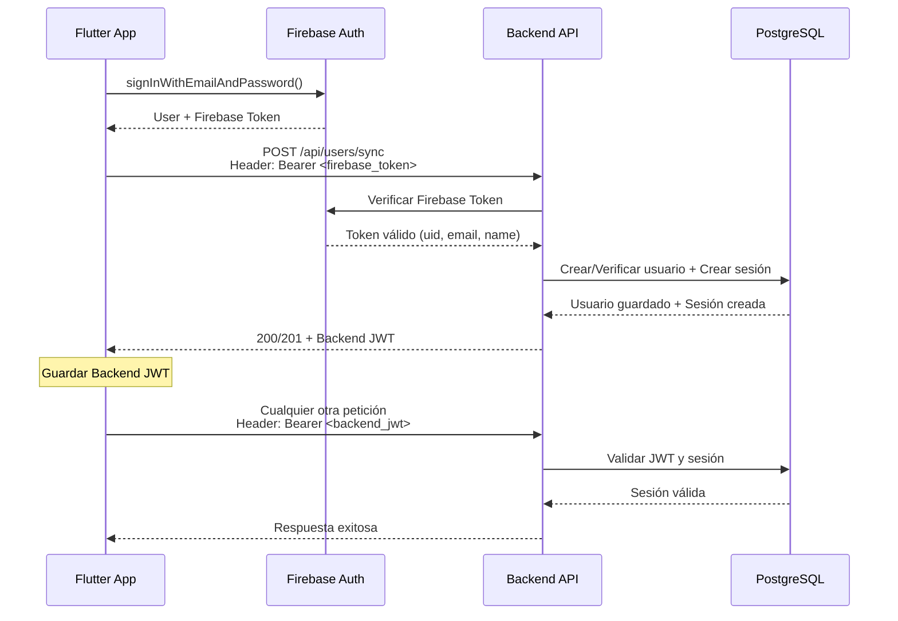

# ⚙️ Configuración General de la API

Esta guía explica la configuración base necesaria para trabajar con la API de PESkaos.

---

## 🔧 URLs Base del Servidor

### Desarrollo Local

**URL Principal:**

```
http://localhost:3001
```

### Desarrollo Móvil

Dependiendo de tu entorno de desarrollo:

| Entorno                | URL                              |
| ---------------------- | -------------------------------- |
| **Android Emulator**   | `http://10.0.2.2:3001`           |
| **iOS Simulator**      | `http://localhost:3001`          |
| **Dispositivo Físico** | `http://[IP_DE_TU_MAQUINA]:3001` |

**Ejemplo para dispositivo físico:**

```
http://192.168.1.100:3001
```

---

## 🔐 Autenticación

La API utiliza un **sistema de doble autenticación**:

### 1️⃣ Token de Firebase (Inicial)

Usado **solo** para el endpoint de sincronización (`/api/users/sync`).

```dart
// Obtener token de Firebase
final firebaseToken = await FirebaseAuth.instance.currentUser?.getIdToken();
```

### 2️⃣ JWT del Backend (Todas las demás peticiones)

Después de sincronizar, el backend devuelve un JWT propio que debes usar en **todas** las peticiones futuras.

```dart
// Enviar en el header Authorization
headers: {
  'Authorization': 'Bearer $backendJWT',
  'Content-Type': 'application/json',
}
```

---

## 🔄 Flujo de Autenticación Completo



### Pasos:

1. **Login con Firebase**: El usuario se autentica con Firebase (email/password, Google, etc.)
2. **Obtener Firebase Token**: El frontend obtiene el ID token de Firebase
3. **Sincronizar con Backend**: Se envía el Firebase token a `POST /api/users/sync`
4. **Recibir Backend JWT**: El backend devuelve su propio JWT
5. **Guardar Backend JWT**: El frontend guarda el JWT (SharedPreferences, SecureStorage)
6. **Usar en peticiones**: Todas las peticiones futuras usan el Backend JWT

---

## 📦 JWT del Backend - Contenido

El JWT devuelto por el backend contiene:

```json
{
  "uid": "firebase_user_id",
  "email": "usuario@ejemplo.com",
  "name": "Nombre",
  "surname": "Apellido",
  "profile_picture": "url_de_foto",
  "role": "client", // o "admin", "institution"
  "points": 0,
  "streak": 0,
  "iat": 1698086400, // Fecha de emisión (timestamp)
  "exp": 1698090000 // Fecha de expiración (timestamp)
}
```

### Decodificar el JWT en Dart

```dart
import 'package:jwt_decode/jwt_decode.dart';

final payload = Jwt.parseJwt(backendJWT);

print('UID: ${payload['uid']}');
print('Email: ${payload['email']}');
print('Rol: ${payload['role']}');
print('Puntos: ${payload['points']}');
```

---

## 🚨 Códigos de Error HTTP

| Código | Significado           | Causa Común                                 | Solución                         |
| ------ | --------------------- | ------------------------------------------- | -------------------------------- |
| `200`  | OK                    | Operación exitosa                           | Procesar respuesta normalmente   |
| `201`  | Created               | Recurso creado exitosamente                 | Procesar respuesta normalmente   |
| `400`  | Bad Request           | Datos mal formateados o incompletos         | Verificar el body de la petición |
| `401`  | Unauthorized          | Token inválido, expirado o no proporcionado | Refrescar token o re-autenticar  |
| `403`  | Forbidden             | Sin permisos para realizar la acción        | Verificar rol del usuario        |
| `404`  | Not Found             | Ruta o recurso no existe                    | Verificar URL del endpoint       |
| `409`  | Conflict              | Recurso duplicado (ej: email ya existe)     | Informar al usuario              |
| `500`  | Internal Server Error | Error del servidor                          | Contactar soporte backend        |

---

## 🔑 Códigos de Error Específicos

Todas las respuestas de error incluyen un campo `code` para identificar el tipo de error:

### Errores de Autenticación

| Code              | Descripción            | Cuándo ocurre                | Solución                              |
| ----------------- | ---------------------- | ---------------------------- | ------------------------------------- |
| `NO_TOKEN`        | Token no proporcionado | Falta header `Authorization` | Incluir header con token              |
| `TOKEN_EXPIRED`   | Token expirado         | JWT caducado                 | Llamar a `/api/users/sync` nuevamente |
| `INVALID_TOKEN`   | Token inválido         | Token malformado o revocado  | Re-autenticar usuario                 |
| `SESSION_REVOKED` | Sesión revocada        | Admin revocó la sesión       | Forzar logout y re-login              |

### Errores de Datos

| Code              | Descripción                  | Solución                                  |
| ----------------- | ---------------------------- | ----------------------------------------- |
| `INCOMPLETE_DATA` | Datos obligatorios faltantes | Verificar que uid y email estén presentes |
| `NAME_REQUIRED`   | Nombre del usuario faltante  | Asegurar que Firebase devuelva el nombre  |
| `INVALID_FORMAT`  | Formato de datos incorrecto  | Verificar tipos de datos                  |

### Errores de Base de Datos

| Code                | Descripción         | Solución                            |
| ------------------- | ------------------- | ----------------------------------- |
| `USER_EXISTS`       | Usuario duplicado   | Informar que ya existe (no crítico) |
| `FOREIGN_KEY_ERROR` | Error de referencia | Contactar backend                   |
| `DATABASE_ERROR`    | Error general de BD | Contactar backend                   |

---

## 📝 Formato de Respuestas

### Respuesta Exitosa

```json
{
  "success": true,
  "message": "Operación exitosa",
  "jwt": "<token>",  // Solo en endpoints que devuelven JWT
  "data": { ... }     // Datos adicionales según el endpoint
}
```

### Respuesta de Error

```json
{
  "success": false,
  "message": "Descripción del error legible",
  "code": "ERROR_CODE"
}
```

---

## 🛠️ Manejo de Errores en Dart

### Función Genérica de Manejo

```dart
Future<bool> handleApiResponse(http.Response response) async {
  final data = jsonDecode(response.body);

  if (data['success'] == true) {
    return true;
  }

  // Manejar según código de error
  switch (data['code']) {
    case 'NO_TOKEN':
    case 'INVALID_TOKEN':
    case 'SESSION_REVOKED':
      // Forzar logout y redirigir a login
      await FirebaseAuth.instance.signOut();
      navigateToLogin();
      break;

    case 'TOKEN_EXPIRED':
      // Re-sincronizar con backend
      await syncUserToBackend();
      break;

    case 'DATABASE_ERROR':
      showError('Error del servidor. Intenta más tarde.');
      break;

    default:
      showError(data['message']);
  }

  return false;
}
```

---

## ⏱️ Expiración de Tokens

### Firebase Token

- **Duración**: 1 hora
- **Solución al expirar**: `user.getIdToken(forceRefresh: true)`

### Backend JWT

- **Duración**: Configurable (por defecto 24 horas)
- **Solución al expirar**: Llamar a `/api/users/sync` con un Firebase token fresco

---

## 🔁 Auto-refresh ("Recuérdame")

Para que el usuario no tenga que iniciar sesión manualmente con frecuencia, utiliza este patrón:

1. Usa el JWT del backend en todas las peticiones.
2. Si recibes `401 TOKEN_EXPIRED`, pide a Firebase un token fresco con `getIdToken(forceRefresh: true)`.
3. Llama a `POST /api/users/sync` con ese token para obtener un nuevo JWT del backend.
4. Guarda el nuevo JWT y reintenta automáticamente la petición original.

### Dart/Flutter (patrón de reintento)

```dart
import 'dart:convert';
import 'package:http/http.dart' as http;
import 'package:firebase_auth/firebase_auth.dart';
import 'package:shared_preferences/shared_preferences.dart';

Future<http.Response> apiRequest(
  String method,
  Uri uri, {
  Map<String, String>? headers,
  Object? body,
}) async {
  final prefs = await SharedPreferences.getInstance();
  String? jwt = prefs.getString('backend_jwt');

  Future<http.Response> _send(String? token) {
    final h = {
      'Content-Type': 'application/json',
      if (token != null) 'Authorization': 'Bearer $token',
      ...?headers,
    };
    switch (method.toUpperCase()) {
      case 'POST':
        return http.post(uri, headers: h, body: body);
      case 'PUT':
        return http.put(uri, headers: h, body: body);
      case 'DELETE':
        return http.delete(uri, headers: h);
      default:
        return http.get(uri, headers: h);
    }
  }

  // 1º intento
  var res = await _send(jwt);
  if (res.statusCode != 401) return res;

  // Intentar auto-refresh
  final user = FirebaseAuth.instance.currentUser;
  if (user == null) return res; // No hay sesión en Firebase

  final freshFirebaseToken = await user.getIdToken(true);
  // Re-sincronizar con backend
  final syncRes = await http.post(
    Uri.parse('http://localhost:3001/api/users/sync'),
    headers: {
      'Authorization': 'Bearer $freshFirebaseToken',
      'Content-Type': 'application/json',
    },
  );

  if (syncRes.statusCode == 200 || syncRes.statusCode == 201) {
    final data = jsonDecode(syncRes.body);
    final newJWT = data['jwt'];
    await prefs.setString('backend_jwt', newJWT);
    // Reintentar la petición original
    return _send(newJWT);
  }

  return res; // Falló el refresh
}
```

### JavaScript/TypeScript (fetch wrapper)

```javascript
async function apiFetch(input, init = {}) {
  const getJWT = () => localStorage.getItem('backend_jwt');
  const setJWT = (t) => localStorage.setItem('backend_jwt', t);

  const send = async (token) => {
    const headers = new Headers(init.headers || {});
    headers.set('Content-Type', 'application/json');
    if (token) headers.set('Authorization', `Bearer ${token}`);
    const resp = await fetch(input, { ...init, headers });
    return resp;
  };

  let resp = await send(getJWT());
  if (resp.status !== 401) return resp;

  // Intentar auto-refresh llamando a /api/users/sync con Firebase ID Token
  const firebaseToken = await window.firebase.auth().currentUser?.getIdToken(true);
  if (!firebaseToken) return resp;

  const syncResp = await fetch('http://localhost:3001/api/users/sync', {
    method: 'POST',
    headers: {
      Authorization: `Bearer ${firebaseToken}`,
      'Content-Type': 'application/json',
    },
  });

  if (syncResp.ok) {
    const { jwt } = await syncResp.json();
    setJWT(jwt);
    resp = await send(jwt); // reintento
  }

  return resp;
}
```

---

## 📦 Dependencias de Dart/Flutter

Añade en tu `pubspec.yaml`:

```yaml
dependencies:
  firebase_auth: ^4.15.0
  http: ^1.1.0
  jwt_decode: ^0.3.1
  shared_preferences: ^2.2.2
  # O para mayor seguridad:
  flutter_secure_storage: ^9.0.0
```

---

## 🔒 Almacenamiento Seguro del JWT

### Opción 1: SharedPreferences (Desarrollo)

```dart
import 'package:shared_preferences/shared_preferences.dart';

// Guardar JWT
Future<void> saveJWT(String jwt) async {
  final prefs = await SharedPreferences.getInstance();
  await prefs.setString('backend_jwt', jwt);
}

// Obtener JWT
Future<String?> getJWT() async {
  final prefs = await SharedPreferences.getInstance();
  return prefs.getString('backend_jwt');
}

// Eliminar JWT (logout)
Future<void> deleteJWT() async {
  final prefs = await SharedPreferences.getInstance();
  await prefs.remove('backend_jwt');
}
```

### Opción 2: FlutterSecureStorage (Producción Recomendado)

```dart
import 'package:flutter_secure_storage/flutter_secure_storage.dart';

final storage = FlutterSecureStorage();

// Guardar JWT
await storage.write(key: 'backend_jwt', value: jwt);

// Obtener JWT
final jwt = await storage.read(key: 'backend_jwt');

// Eliminar JWT
await storage.delete(key: 'backend_jwt');
```

---

## 🧪 Testing

### Con cURL

```bash
# Con Firebase token
curl -X POST http://localhost:3001/api/users/sync \
  -H "Authorization: Bearer <FIREBASE_TOKEN>" \
  -H "Content-Type: application/json"

# Con Backend JWT
curl -X GET http://localhost:3001/api/some-endpoint \
  -H "Authorization: Bearer <BACKEND_JWT>" \
  -H "Content-Type: application/json"
```

### Con Postman

1. Crear una variable de entorno `backend_jwt`
2. En cada petición:
   - **Headers** → `Authorization`: `Bearer {{backend_jwt}}`
   - **Headers** → `Content-Type`: `application/json`

---

## 📌 Notas Importantes

1. **Dos tokens diferentes**:
   - Firebase Token → Solo para `/api/users/sync`
   - Backend JWT → Para todas las demás peticiones

2. **Guardar el Backend JWT**: Después de `/api/users/sync`, guarda el JWT devuelto y úsalo en todas las peticiones.

3. **CORS**: En desarrollo, el servidor acepta peticiones de cualquier origen. En producción se restringirá.

4. **Puerto por defecto**: `3001` (configurable en `.env`)

5. **Sesiones revocables**: El backend puede invalidar sesiones en cualquier momento (logout forzado).

---

**Siguiente**: [Resumen de Endpoints →](02-endpoints-resumen.md)
