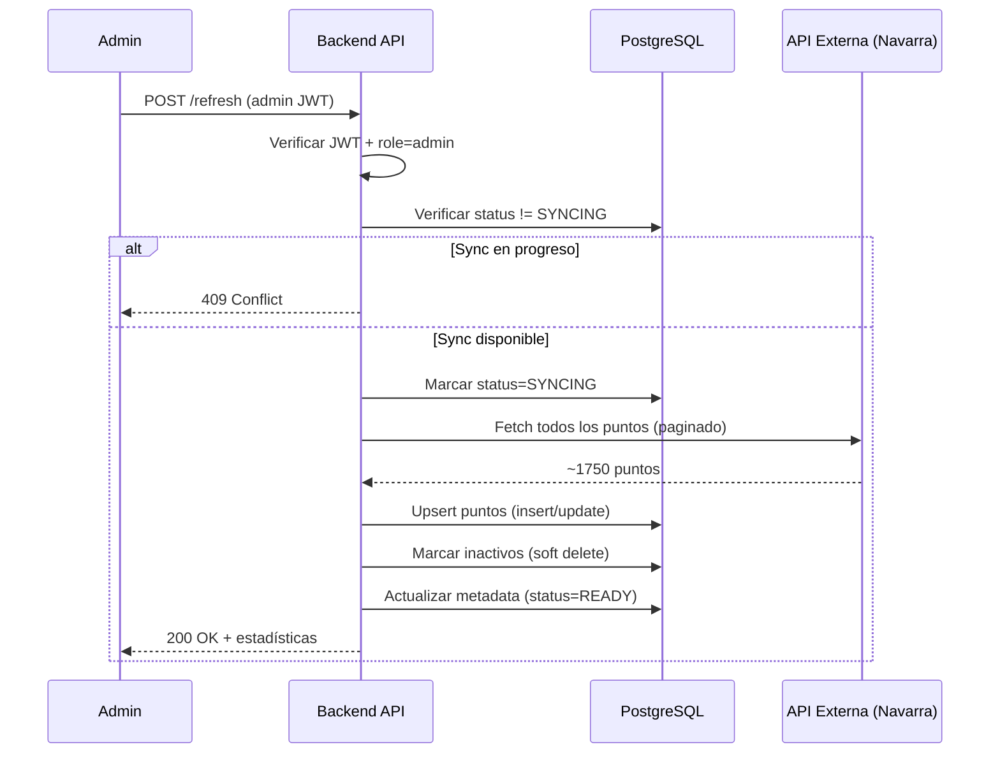

# POST /api/recycling-points/:region/refresh - Forzar Sincronización del Cache

Fuerza una sincronización inmediata del cache de puntos de reciclaje para una región específica. Este endpoint es útil para **administradores que necesitan actualizar datos manualmente** sin esperar al cron job automático.

---

## 📋 Información General

|                   |                                             |
| ----------------- | ------------------------------------------- |
| **Método**        | `POST`                                      |
| **URL**           | `/api/recycling-points/:region/refresh`     |
| **Autenticación** | ✅ Requerida (Backend JWT)                  |
| **Rol requerido** | 🔒 **Admin**                                |
| **Duración**      | ~20-30 segundos (depende de la API externa) |

---

## 🔐 Restricciones de Acceso

Este endpoint está **protegido y solo accesible para administradores**:

- ✅ **Admins**: Acceso completo
- ❌ **Clientes**: Acceso denegado (403 Forbidden)
- ❌ **Instituciones**: Acceso denegado (403 Forbidden)
- ❌ **No autenticados**: Acceso denegado (401 Unauthorized)

---

## 📤 Request

### URL Parameters

| Parámetro | Tipo   | Requerido | Descripción                                      |
| --------- | ------ | --------- | ------------------------------------------------ |
| `region`  | string | ✅         | Región a sincronizar (`navarra`, `barcelona`, etc.) |

### Headers

```
Authorization: Bearer <BACKEND_JWT>
Content-Type: application/json
```

**Importante**: El JWT debe contener `"role": "admin"` en su payload.

### Body

❌ No requiere body. El endpoint se invoca sin datos adicionales.

---

## 📥 Response

### ✅ Éxito (200 OK)

Sincronización completada exitosamente:

```json
{
  "success": true,
  "message": "Sincronización de Navarra completada",
  "region": "navarra",
  "inserted": 15,
  "updated": 1720,
  "deactivated": 3,
  "total_records": 1735,
  "sync_duration_ms": 22450
}
```

### Campos de Respuesta

| Campo              | Tipo    | Descripción                                          |
| ------------------ | ------- | ---------------------------------------------------- |
| `success`          | boolean | Indica si la operación fue exitosa                   |
| `message`          | string  | Mensaje descriptivo del resultado                    |
| `region`           | string  | Región sincronizada                                  |
| `inserted`         | integer | Nuevos puntos añadidos al cache                      |
| `updated`          | integer | Puntos existentes actualizados                       |
| `deactivated`      | integer | Puntos marcados como inactivos (ya no en API)       |
| `total_records`    | integer | Total de puntos activos tras la sincronización       |
| `sync_duration_ms` | integer | Duración de la sincronización en milisegundos       |

---

### ⚠️ Sincronización ya en progreso (409 Conflict)

Si otra sincronización está ejecutándose (manual o automática por cron):

```json
{
  "success": false,
  "message": "SYNC_IN_PROGRESS",
  "code": "SYNC_IN_PROGRESS"
}
```

**Solución**: Espera 20-30 segundos a que termine la sincronización actual y reintenta.

---

### ❌ Error - No autenticado (401 Unauthorized)

```json
{
  "success": false,
  "message": "No authentication token provided",
  "code": "NO_TOKEN"
}
```

### ❌ Error - No es admin (403 Forbidden)

```json
{
  "success": false,
  "message": "Admin privileges required",
  "code": "FORBIDDEN"
}
```

### ❌ Error - Región no encontrada (404 Not Found)

```json
{
  "success": false,
  "message": "Región no encontrada: madrid",
  "code": "REGION_NOT_FOUND"
}
```

### ❌ Error - Sincronización falló (500 Internal Server Error)

```json
{
  "success": false,
  "message": "Failed to fetch Navarra points: ETIMEDOUT",
  "code": "SYNC_FAILED"
}
```

**Causas comunes**:
- API externa no responde (timeout)
- Proxy de Cloudflare caído
- Error de red/conectividad
- Error en el parseo de datos

---

## 💡 Ejemplos de Uso

### cURL

```bash
# Forzar sincronización de Navarra
curl -X POST http://localhost:3001/api/recycling-points/navarra/refresh \
  -H "Authorization: Bearer <ADMIN_JWT>" \
  -H "Content-Type: application/json"
```

### Dart/Flutter (Panel de Admin)

```dart
import 'package:http/http.dart' as http;
import 'dart:convert';

Future<SyncResult> forceRefresh(String region, String adminJWT) async {
  final uri = Uri.parse('http://localhost:3001/api/recycling-points/$region/refresh');
  
  final response = await http.post(
    uri,
    headers: {
      'Authorization': 'Bearer $adminJWT',
      'Content-Type': 'application/json',
    },
  );

  final data = jsonDecode(response.body);

  if (response.statusCode == 200) {
    return SyncResult.fromJson(data);
  } else if (response.statusCode == 409) {
    throw SyncInProgressException('Sincronización ya en progreso');
  } else if (response.statusCode == 403) {
    throw UnauthorizedException('Requiere privilegios de administrador');
  } else if (response.statusCode == 500) {
    throw SyncFailedException(data['message'] ?? 'Error de sincronización');
  }
  
  throw Exception('Error inesperado al forzar sincronización');
}

// Modelos
class SyncResult {
  final bool success;
  final String message;
  final String region;
  final int inserted;
  final int updated;
  final int deactivated;
  final int totalRecords;
  final int syncDurationMs;

  SyncResult.fromJson(Map<String, dynamic> json)
      : success = json['success'],
        message = json['message'],
        region = json['region'],
        inserted = json['inserted'],
        updated = json['updated'],
        deactivated = json['deactivated'],
        totalRecords = json['total_records'],
        syncDurationMs = json['sync_duration_ms'];
}

// Uso con indicador de progreso
void syncRegion(String region) async {
  showLoadingDialog('Sincronizando $region...');
  
  try {
    final result = await forceRefresh(region, adminToken);
    hideLoadingDialog();
    
    showSuccessSnackbar(
      'Sincronización completada:\n'
      '+${result.inserted} nuevos, '
      '${result.updated} actualizados, '
      '-${result.deactivated} desactivados\n'
      'Total: ${result.totalRecords} puntos'
    );
  } on SyncInProgressException {
    hideLoadingDialog();
    showWarningSnackbar('Ya hay una sincronización en progreso. Intenta en 30s.');
  } on SyncFailedException catch (e) {
    hideLoadingDialog();
    showErrorDialog('Error de sincronización', e.message);
  } catch (e) {
    hideLoadingDialog();
    showErrorDialog('Error', e.toString());
  }
}
```

### JavaScript/TypeScript (Dashboard Admin)

```typescript
interface SyncResult {
  success: boolean;
  message: string;
  region: string;
  inserted: number;
  updated: number;
  deactivated: number;
  total_records: number;
  sync_duration_ms: number;
}

async function forceRefresh(region: string, adminJWT: string): Promise<SyncResult> {
  const response = await fetch(`http://localhost:3001/api/recycling-points/${region}/refresh`, {
    method: 'POST',
    headers: {
      'Authorization': `Bearer ${adminJWT}`,
      'Content-Type': 'application/json',
    },
  });

  const data = await response.json();

  if (response.status === 409) {
    throw new Error('Sincronización ya en progreso. Intenta en 30 segundos.');
  }

  if (response.status === 403) {
    throw new Error('Requiere privilegios de administrador');
  }

  if (!response.ok) {
    throw new Error(data.message || 'Error al forzar sincronización');
  }

  return data;
}

// Uso con UI feedback
async function syncWithFeedback(region: string) {
  const button = document.getElementById(`sync-${region}-btn`) as HTMLButtonElement;
  const spinner = document.getElementById(`sync-${region}-spinner`) as HTMLElement;
  
  button.disabled = true;
  spinner.style.display = 'inline-block';

  try {
    const result = await forceRefresh(region, adminToken);
    
    console.log(`✅ Sync completado en ${(result.sync_duration_ms / 1000).toFixed(1)}s`);
    console.log(`   +${result.inserted} nuevos`);
    console.log(`   ~${result.updated} actualizados`);
    console.log(`   -${result.deactivated} desactivados`);
    console.log(`   Total: ${result.total_records} puntos`);
    
    showNotification('success', `${region} sincronizado correctamente`);
  } catch (error) {
    console.error('❌ Error de sincronización:', error);
    showNotification('error', error.message);
  } finally {
    button.disabled = false;
    spinner.style.display = 'none';
  }
}
```

---

## 🎯 Casos de Uso

### 1. Actualización Manual de Emergencia

Cuando la API externa actualiza datos importantes y necesitas reflejarlos inmediatamente sin esperar al cron:

```bash
# Navarra acaba de publicar nuevos puntos de reciclaje
curl -X POST http://localhost:3001/api/recycling-points/navarra/refresh \
  -H "Authorization: Bearer $ADMIN_JWT"
```

### 2. Verificación Post-Despliegue

Después de desplegar cambios en el servicio de sincronización, verificar que funciona:

```javascript
// Test en producción tras deploy
await forceRefresh('navarra', adminToken);
await checkCacheStatus('navarra', adminToken); // Verificar que status === 'READY'
```

### 3. Cold Start del Sistema

Al iniciar el servidor por primera vez, poblar el cache manualmente en lugar de esperar al cron:

```bash
# Sincronizar todas las regiones al iniciar
for region in navarra barcelona; do
  curl -X POST http://localhost:3001/api/recycling-points/$region/refresh \
    -H "Authorization: Bearer $ADMIN_JWT"
  sleep 30  # Evitar overlaps
done
```

### 4. Dashboard de Admin con Botón de Refresh

Interfaz de administración que permita sincronizar bajo demanda:

```jsx
// React component
function RegionSyncButton({ region, adminToken }) {
  const [syncing, setSyncing] = useState(false);
  
  async function handleSync() {
    setSyncing(true);
    try {
      const result = await forceRefresh(region, adminToken);
      toast.success(`✅ ${result.total_records} puntos sincronizados`);
    } catch (error) {
      toast.error(`❌ ${error.message}`);
    } finally {
      setSyncing(false);
    }
  }

  return (
    <button onClick={handleSync} disabled={syncing}>
      {syncing ? '⏳ Sincronizando...' : '🔄 Forzar Sync'}
    </button>
  );
}
```

---

## ⚡ Performance y Consideraciones

### Duración Esperada

| Región   | Puntos Aprox. | Duración Típica | Timeout |
| -------- | ------------- | --------------- | ------- |
| Navarra  | ~1750         | 20-25 segundos  | 30s     |
| Barcelona | ~5000         | 30-40 segundos  | 60s     |

**Nota**: La duración depende de la latencia de la API externa y el tamaño del dataset.

### Limitaciones

- **Un sync a la vez**: Si una sincronización está en progreso (manual o cron), las peticiones adicionales retornan 409 Conflict.
- **No paralelizable**: No se pueden sincronizar múltiples regiones simultáneamente desde el mismo worker.
- **Timeout del cliente**: Configura timeouts largos (60s+) en tu cliente HTTP para evitar timeouts prematuros.

### Recomendaciones

1. **Mostrar feedback al usuario**: Usa spinners o progress bars durante la sincronización.
2. **Manejo de 409**: Reintenta automáticamente tras 30s si recibes Conflict.
3. **Logging**: Registra todas las sincronizaciones manuales para auditoría.
4. **Rate limiting**: Evita ejecutar refreshes repetidos en corto tiempo.

---

## 🔄 Flujo de Sincronización



---

## 📊 Interpretación de Resultados

### Sincronización Normal

```json
{
  "inserted": 15,
  "updated": 1720,
  "deactivated": 3,
  "total_records": 1735
}
```

**Interpretación**:
- 15 puntos nuevos desde la última sync
- 1720 puntos existentes actualizados (horarios, ubicaciones, etc.)
- 3 puntos desactivados (eliminados de la API externa)
- Total final: 1735 puntos activos

### Primera Sincronización (Cold Start)

```json
{
  "inserted": 1750,
  "updated": 0,
  "deactivated": 0,
  "total_records": 1750
}
```

**Interpretación**: Todos los puntos son nuevos (cache estaba vacío).

### Sin Cambios

```json
{
  "inserted": 0,
  "updated": 1750,
  "deactivated": 0,
  "total_records": 1750
}
```

**Interpretación**: No hay puntos nuevos ni eliminados, pero se refrescaron timestamps de los existentes.

---

## 🐛 Troubleshooting

### 409 Conflict persistente

**Causa**: Una sincronización previa se quedó "colgada" en estado SYNCING.

**Solución**:
1. Verifica en `/status` si `status === 'SYNCING'` lleva >5 minutos
2. Si es así, resetea manualmente en la BD:
   ```sql
   UPDATE cache_metadata 
   SET status = 'READY' 
   WHERE source = 'NAVARRA_POINTS';
   ```
3. Reintenta el refresh

### Timeout del cliente

**Causa**: El cliente HTTP tiene timeout <30s.

**Solución**: Aumenta el timeout de tu cliente:
```dart
// Dart
final client = http.Client();
client.timeout = Duration(seconds: 60);

// JavaScript
fetch(url, { signal: AbortSignal.timeout(60000) })
```

### Sync retorna OK pero total_records = 0

**Causa**: La API externa no devolvió datos (posible mantenimiento).

**Solución**:
1. Revisa `error_message` en `/status`
2. Verifica que la API externa esté disponible
3. Comprueba variables de entorno `NAVARRA_PROXY_BASE`, `NAVARRA_RESOURCE_ID`

### 403 aunque el usuario es admin

**Causa**: El JWT no tiene `role: 'admin'` en el payload.

**Solución**:
1. Decodifica el JWT para verificar el campo `role`
2. Si es incorrecto, vuelve a llamar a `/api/users/sync` con Firebase token
3. Verifica que el usuario esté en la tabla `admin` de la BD

---

## 📝 Notas Importantes

1. **Solo Admin**: Este endpoint puede sobrecargar APIs externas si se abusa, por eso está restringido.

2. **Idempotente**: Es seguro ejecutar este endpoint múltiples veces (solo actualiza lo necesario).

3. **Transaccional**: Si falla a mitad de camino, el estado vuelve a ERROR sin corromper datos parciales.

4. **No interrumpe servicio**: Durante la sincronización, el endpoint público sigue sirviendo datos del cache.

5. **Logs detallados**: Cada sincronización genera logs con timestamps para auditoría.

---

**Ver también**:
- [GET /api/recycling-points/:region/status →](recycling-points-status.md)
- [GET /api/recycling-points/:region →](recycling-points-region.md)
